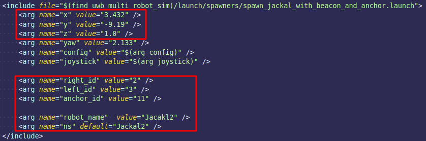
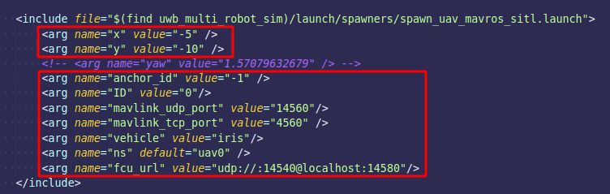

# UWB Simulation in Multi-Robot Systems

This is a repo to simulate the Ultra-wideband positioning system (global and relative) in multi-robot system.

## Installation

### PX4 Flight Control
1. GitHub link
    https://github.com/PX4/PX4-Autopilot
2. Build 
    ```
    git clone https://github.com/PX4/PX4-Autopilot.git --recursive
    make px4_sitl gazebo
    ```
   
### Build uwb_multi_robot_sim package
```
catkin_make -DCATKIN_WHITELIST_PACKAGES="uwb_multi_robot_sim" -j$(nproc)
```
catkin_build is also fine. just choose the way you prefer.

### Download more simulated worlds (Optional)


## Simulation Configuration

### Add more mobile robot
1. Open the launch file in ` ./launch/scenarios/scenarioDroneMobile_px4.launch`.
2. Copy the code block shown in the launch file which looks like the picture below. 
   
3. Change the configuration shown in the picture above

### Add more drones
1. Open the launch file in ` ./launch/scenarios/scenarioDroneMobile_px4.launch`.
2. Copy the code block shown in the launch file which looks like the picture below. 
   
3. Change the configuration shown in the picture above

### Change environment around
`TO DO`

## Simulation Launch
1. Set PX4 environment
```
cd PX4_Autopilot
source Tools/setup_gazebo.bash $(pwd) $(pwd)/build/px4_sitl_default
export ROS_PACKAGE_PATH=$ROS_PACKAGE_PATH:$(pwd)
export ROS_PACKAGE_PATH=$ROS_PACKAGE_PATH:$(pwd)/Tools/sitl_gazebo
```

2. launch the UAV and UGV simulation scenario
```
roslaunch uwb_multi_robot_sim scenarioDroneMobile_px4.launch
```

## Robot Control

### PX4 Control Fly Simulate
```
export ROS_NAMESPACE=uav0 # according to the robot you want to control
roslaunch uwb_multi_robot_sim fly_simulate.launch
```

### Keyboard Control
```
export ROS_NAMESPACE=uav0 # according to the robot you want to control
rosrun teleop_twist_keyboard teleop_twist_keyboard.py
``` 
