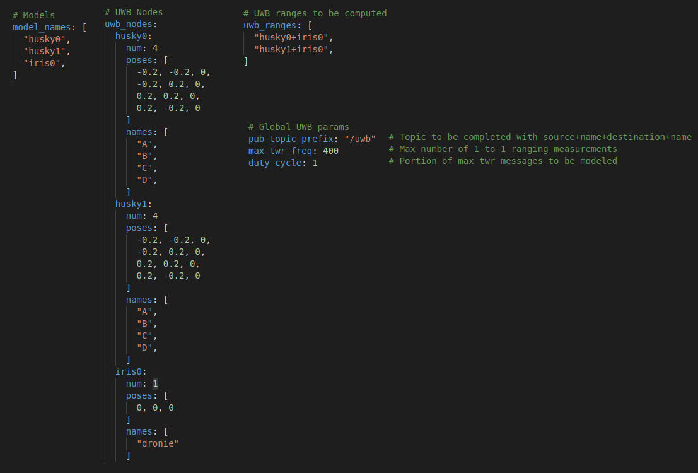
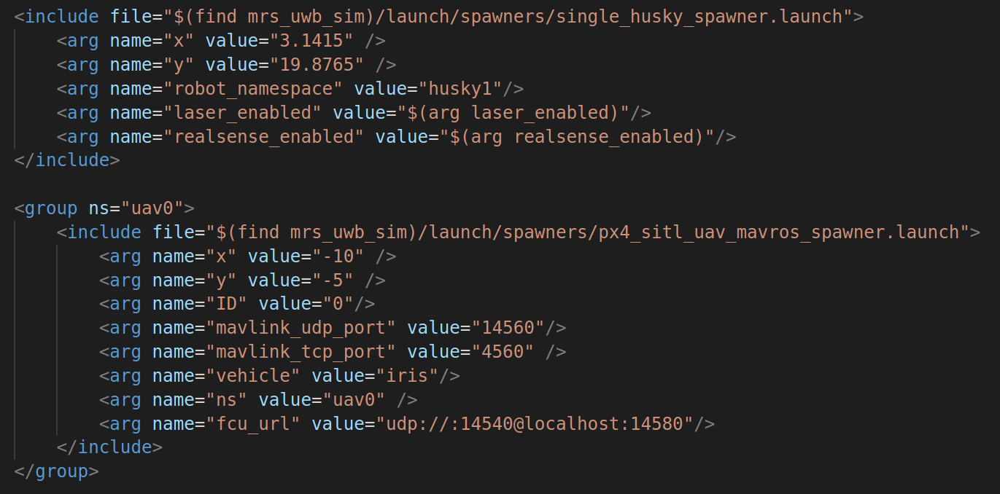

[](https://opensource.org/licenses/MIT)

# Multi-robot UGVs+UAVs with UWB | Gazebo Sim


| Status  |
|---------|
|  |


## Description

Gazebo simulations for relative UWB-based localization. Focus on modeling UWB noise cause by ground and aerial robots in addition to their environment.

The simulator uses ClearPath Husky robots as ground units and PX4 iris quadrotors as aerial units with SITL simulation.


## Dependencies

This package depends on `mavros` and `husky_gazebo` mainly. Install dependencies for ROS Melodic:
```
sudo apt install ros-melodic-mavros ros-melodic-mavros-extras python-catkin-tools \
    ros-melodic-husky-gazebo python-pip python-dev python3-pip python3-dev \
    libgstreamer-plugins-base1.0-dev gstreamer1.0-plugins-bad gstreamer1.0-plugins-base gstreamer1.0-plugins-good gstreamer1.0-plugins-ugly

    
sudo -H python3 -m pip install empy jinja2 packaging toml numpy jsonschema
```

Other dependencies
```
wget https://raw.githubusercontent.com/mavlink/mavros/master/mavros/scripts/install_geographiclib_datasets.sh
sudo bash ./install_geographiclib_datasets.sh
```

## Installation

Create a catkin workspace
```
mkdir -p ~/mrs_uwb_sim_ws/src
cd mrs_uwb_sim_ws/src
```

Clone this repository and the `tiers_ros_msgs` dependency:
```
git clone git@github.com:TIERS/mrs-uwb-sim.git
git clone https://github.com/TIERS/tiers-ros-msgs
```

Build it (`catkin` recommended):
```
catkin build
```

## Download PX4

To be able to launch aerial units in the simulator, we use PX4 and its SITL simulation.

In your catkin workspace, download the PX4 Autopilot stack and built the sitl simulation files:
```
cd ~/mrs_uwb_sim_ws
git clone https://github.com/PX4/PX4-Autopilot.git --recursive
cd PX4-Autopilot
DONT_RUN=1 make px4_sitl gazebo
```

Copy the modified quadrotos __sdf__ file:
```
mv ~/mrs_uwb_sim_ws/PX4-Autopilot/Tools/sitl_gazebo/models/iris/iris.sdf.jinja ~/mrs_uwb_sim_ws/PX4-Autopilot/Tools/sitl_gazebo/models/iris/iris.sdf.jinja.old
mv ~/mrs_uwb_sim_ws/src/mrs-uwb-sim/models/sdf/iris.sdf.jinja ~/mrs_uwb_sim_ws/PX4-Autopilot/Tools/sitl_gazebo/models/iris/iris.sdf.jinja
```
   
## Launch simulation

Before launching the simulations, you will need to source PX4 files on top of the `devel/setup,bash`.
A script in this repo does both. Move it to your workspace root and source it:
```
mv ~/mrs_uwb_sim_ws/src/mrs-uwb-sim/source_all.bash ~/mrs_uwb_sim_ws/source_all.bash
cd ~/mrs_uwb_sim_ws
source source_all.bash
```

Alternatively, you will need to run the following:
```
cd PX4-Autopilot
source Tools/setup_gazebo.bash $(pwd) $(pwd)/build/px4_sitl_default
export ROS_PACKAGE_PATH=$ROS_PACKAGE_PATH:$(pwd)
export ROS_PACKAGE_PATH=$ROS_PACKAGE_PATH:$(pwd)/Tools/sitl_gazebo
```

Now you can directly:
```
roslaunch mrs_uwb_sim tiers_mrs_px4.launch
```

To launch only the UWB simulator (for example while running a rosbag recorded with Gazebo):
```
roslaunch mrs_uwb_sim uwb_sim.launch
```

## UWB Ranging simulation and configuration

The basic parameters defining the position are the following:
- `model_names`: list of Gazebo model names where UWB nodes are simulated to be.
- `uwb_nodes`: list of UWB nodes per model, including the number, their positions relative to the model position and the names (used for the ranging topic names).
- `uwb_ranges`: list of UWB ranges to be calculated and published.



### UWB noise simulation

`TODO`

### Add more mobile robots (Husky and PX4 Iris)
1. Open the launch file in ` ./launch/tiers_mrs_px4.launch`.
2. Add as many code blocks for the `husky` and `iris` vehicles as shown in the image
   
3. Change at least the following configuration parameters:
   - `x` and `y` to set the initial position
   - `robot_namespace` for the Husky spawners (different for each robot), used as the robot's ROS namespace.
   - `ID` and `ns` for the Iris spawners (different for each quadrotor), used as the robot's ROS namespace.
